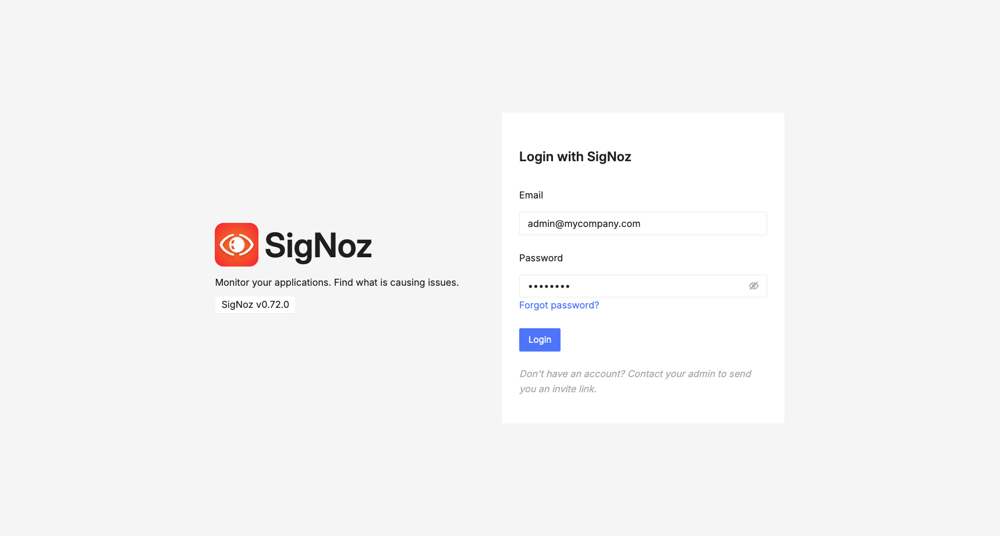

# Observability stack for Spring boot and Oracle database applications (Using SigNoz)

Please go through the [link](https://github.com/lake-of-dreams/spring-oracledb-observability/tree/main?tab=readme-ov-file#observability-stack-for-spring-boot-and-oracle-database-applications) for motivation behind this and the previous sample.

Here we achieve the same (or better) level of Observability for the applications, but with much less configuration and without the need of multiple datasources for metrics, traces and logs using [SigNoz](https://signoz.io/)

## Getting started

### Setup Kubernetes and tools

See [Kubernetes cluster](https://github.com/lake-of-dreams/spring-oracledb-observability?tab=readme-ov-file#kubernetes-cluster) and [Install helm and kubectl](https://github.com/lake-of-dreams/spring-oracledb-observability?tab=readme-ov-file#install-helm-and-kubectl).

### Deploy SigNoz Observabilty stack

Ensure you have access to the cluster by executing

```shell
kubectl get ns
```

Deploy [SigNoz helm chart](https://github.com/SigNoz/charts/tree/main/charts/signoz)

```shell

kubectl create ns platform
helm repo add signoz https://charts.signoz.io
helm repo update

helm --namespace platform install my-release signoz/signoz --version 0.73.0 -f ./signoz-values.yaml

```

Have a peek at the `platform` namespace to see all pods are up and running.

```shell
bash-3.2$ kubectl -n platform get pods
NAME                                                        READY   STATUS      RESTARTS       AGE
chi-my-release-clickhouse-cluster-0-0-0                     1/1     Running     1 (66m ago)    3h3m
my-release-clickhouse-operator-95dd478d8-5k8s9              2/2     Running     2 (3h3m ago)   3h3m
my-release-signoz-alertmanager-0                            1/1     Running     0              3h3m
my-release-signoz-frontend-56755fcc5b-fsk4j                 1/1     Running     0              3h3m
my-release-signoz-otel-collector-584cc5bbf5-gd4mm           1/1     Running     0              3h3m
my-release-signoz-otel-collector-metrics-589996d4bb-x4cpx   1/1     Running     0              3h3m
my-release-signoz-query-service-0                           1/1     Running     0              3h3m
my-release-signoz-schema-migrator-async-init-vkghw          0/1     Completed   0              3h3m
my-release-signoz-schema-migrator-sync-init-sjqmc           0/1     Completed   0              3h3m
my-release-zookeeper-0                                      1/1     Running     0              3h3m
```

Deploy SigNoz k8s-infra helm chart to visualized Kubernetes metrics/logs.

```shell
helm install my-release signoz/k8s-infra -f ./k8s-infra-values.yaml
```

Verify cluster and pod level OpenTelemetry collectors are up and runningin `default` namespace.

```shell
my-release-k8s-infra-otel-agent-w4mt6                   1/1     Running   8 (3h28m ago)    4d4h
my-release-k8s-infra-otel-deployment-848b98f45f-x47nn   1/1     Running   11 (3h28m ago)   4d4h
```

### Create SigNoz admin user

An admin user can be created in SigNoz on first login. However, to configure a admin user using the api, follow following steps:

In a separate terminal, execute

```
kubectl -n platform port-forward svc/my-release-signoz-query-service 8095:8080
```

Create the admin user using API in a separate terminal, modify the payload values as per your requirement:

```
curl -kv -X POST http://localhost:8095/api/v1/register -d '{"email":"admin@mycompany.com","name":"Admin","orgName":"mycompany","password":"admin123","isAnonymous":true,"hasOptedUpdates":false}'
```

### Access SigNoz front-end

In a separate terminal, execute:

```
kubectl -n platform port-forward svc/my-release-signoz-frontend 3301:3301
```

The SigNoz front-end will be accessible at http://localhost:3301/ . Login with the credentials provided in [previous step](#create-signoz-admin-user).



More users can be created using the steps mentioned in [Authentication and Login](https://signoz.io/docs/userguide/authentication/).

### Import Dashboards

SigNoz provides several useful dashboards at https://github.com/SigNoz/dashboards. You can manage dashboards from the SigNoz front-end by following steps mentioned in [Manage Dashboards in SigNoz](https://signoz.io/docs/userguide/manage-dashboards/). To configure dashboards using the API:

In a separate terminal, execute (if not already done)

```
kubectl -n platform port-forward svc/my-release-signoz-query-service 8095:8080
```

Execute following commands to import several dashboards mentioned below:

```
export TOKEN=$(curl -s -X POST http://localhost:8095/api/v1/login -d '{"email":"admin@mycompany.com","password":"admin123"}' | jq -r .accessJwt)

echo "Configure Host Metrics Dashboard"
curl -H "Authorization: Bearer $TOKEN" -X POST -d "$(curl -s https://raw.githubusercontent.com/SigNoz/dashboards/refs/heads/main/k8s-infra-metrics/host-metrics.json)" http://localhost:8095/api/v1/dashboards

echo "Configure Cluster Metrics Dashboard"
curl -H "Authorization: Bearer $TOKEN" -X POST -d "$(curl -s https://raw.githubusercontent.com/SigNoz/dashboards/refs/heads/main/k8s-infra-metrics/kubernetes-cluster-metrics.json)" http://localhost:8095/api/v1/dashboards

echo "Configure Node Metrics Dashboard"
curl -H "Authorization: Bearer $TOKEN" -X POST -d "$(curl -s https://raw.githubusercontent.com/SigNoz/dashboards/refs/heads/main/k8s-infra-metrics/kubernetes-node-metrics-detailed.json)" http://localhost:8095/api/v1/dashboards

echo "Configure Pod Metrics Dashbrd"
curl -H "Authorization: Bearer $TOKEN" -X POST -d "$(curl -s https://raw.githubusercontent.com/SigNoz/dashboards/refs/heads/main/k8s-infra-metrics/kubernetes-pod-metrics-detailed.json)" http://localhost:8095/api/v1/dashboards

echo "Configure JVM Metrics By Service Dashboard"
curl -H "Authorization: Bearer $TOKEN" -X POST -d "$(curl -s https://raw.githubusercontent.com/SigNoz/dashboards/refs/heads/main/jvm/jvm-metrics-by-service.json)" http://localhost:8095/api/v1/dashboards

echo "Configure APM Metrics Dashboard"
curl -H "Authorization: Bearer $TOKEN" -X POST -d "$(curl -s https://raw.githubusercontent.com/SigNoz/dashboards/refs/heads/main/apm/apm-metrics.json)" http://localhost:8095/api/v1/dashboards

echo "Configure DB Calls Metrics Dashboard"
curl -H "Authorization: Bearer $TOKEN" -X POST -d "$(curl -s https://raw.githubusercontent.com/SigNoz/dashboards/refs/heads/main/apm/db-calls-monitoring.json)" http://localhost:8095/api/v1/dashboards

echo "Configure HTTP API Monitoring Dashboard"
curl -H "Authorization: Bearer $TOKEN" -X POST -d "$(curl -s https://raw.githubusercontent.com/SigNoz/dashboards/refs/heads/main/apm/http-api-monitoring.json)" http://localhost:8095/api/v1/dashboards

```

### Deploy database

Follow steps mentioned in [Deploy Oracle Database Operator](https://github.com/lake-of-dreams/spring-oracledb-observability?tab=readme-ov-file#deploy-oracle-database-operator) and [Create Oracle Database 23ai free instance](https://github.com/lake-of-dreams/spring-oracledb-observability?tab=readme-ov-file#create-oracle-database-23ai-free-instance) to setup the database.

### Application overview

In this example, we use two services. The `store-manager` service is used to manage the store inventory of products, while a separate `ratings-manager` service can be used to provide rating to any of the products. Consequently any rating provided using the `ratings-manager` results in a change of average rating and the rating count of the product in the `store-manager` service.

We use [Feign](https://docs.spring.io/spring-cloud-openfeign/docs/current/reference/html/) with Kubernetes native service discovery to establish communication between these services.

### Create and push application container image

You can use [build-image](https://docs.spring.io/spring-boot/maven-plugin/build-image.html) maven plugin to create a docker image for the application(s) and then you can push it to a registry such as [ghcr.io](https://docs.github.com/en/packages/learn-github-packages/introduction-to-github-packages) or a hosted registry such as [OCI Container Registry](https://www.oracle.com/in/cloud/cloud-native/container-registry/).

```shell
export STORE_MANAGER_IMAGE="<store-manager-repo>:<tag>"
export RATINGS_MANAGER_IMAGE="<ratings-manager-repo>:<tag>"
cd retail-demo
mvn clean package
cd ./store-manager
mvn spring-boot:build-image -Dspring-boot.build-image.imagePlatform=linux/amd64 -Dspring-boot.build-image.imageName="$STORE_MANAGER_IMAGE" -Dspring-boot.build-image.cleanCache=true
cd ../ratings-manager
mvn spring-boot:build-image -Dspring-boot.build-image.imagePlatform=linux/amd64 -Dspring-boot.build-image.imageName="$RATINGS_MANAGER_IMAGE" -Dspring-boot.build-image.cleanCache=true
podman push "$STORE_MANAGER_IMAGE"
podman push "$RATINGS_MANAGER_IMAGE"
cd ../../

```

### Deploy the application

Edit `./deploy.yaml` and replace `ghcr.io/lake-of-dreams/spring-oracledb-observability-signoz-store-manager:0.0.1-snapshot` and `ghcr.io/lake-of-dreams/spring-oracledb-observability-signoz-ratings-manager:0.0.1-snapshot` with the `STORE_MANAGER_IMAGE` and `RATINGS_MANAGER_IMAGE` from previous step.

Wait till the application is up and running.

```shell
bash-3.2$ kubectl get pods
NAME                                                    READY   STATUS    RESTARTS         AGE
freedb-sample-507io                                     1/1     Running   9 (5h16m ago)    9d
my-release-k8s-infra-otel-agent-w4mt6                   1/1     Running   16 (4h59m ago)   8d
my-release-k8s-infra-otel-deployment-848b98f45f-x47nn   1/1     Running   19 (4h59m ago)   8d
ratings-manager-767449f574-dwzmt                        1/1     Running   0                4h54m
store-manager-96595c75f-pl6ms                           1/1     Running   0                4h54m
```

### Test the service

In a separate terminal window, execute

```shell
kubectl port-forward svc/store-manager 8080:8080
```

Now test the service by executing few api requests in a separate terminale

```shell
curl -kv http://localhost:8080/api/v1/products
curl -kv http://localhost:8080/api/v1/products/1
curl -kv http://localhost:8080/api/v1/products/23193
```

Similarly test the `ratings-manager` service:

In separate terminal windows, execute

```shell
kubectl port-forward svc/ratings-manager 8090:8080
```

```shell
curl -kv http://localhost:8090/api/v1/ratings
curl -kv -X POST -H 'Content-Type: application/json' http://localhost:8090/api/v1/ratings -d '{"productId": 23, "userId": 1, "rating": 3.0}'
curl -kv -X POST -H 'Content-Type: application/json' http://localhost:8090/api/v1/ratings -d '{"productId": 34898, "userId": 4, "rating": 3.0}'
```

### Access front-end to see observability data

In a separate terminal window, execute

```shell
kubectl -n platform port-forward svc/my-release-signoz-frontend 3301:3301
```

Access SigNoz front-end at http://localhost:3301/ . Login with the credentials provided in [previous step](#create-signoz-admin-user).


Click on `ratings-manager-signoz` to access the `Overview` panel and click `http post /api/v1/ratings` key operation.


From "Traces" , click on first trace and expand the spans:


Click on `Go to related logs` to see the logs for this span:


Select `Dashboards` from the left navigation menu to explore dashboards imported previously for several useful metrics for the applications and infrastructure. For example the `JVM Metrics` dashboard provides several useful JVM metrics per service:

.

You can access the [SigNoz documentation](https://signoz.io/docs/introduction/) for other configuration options.
